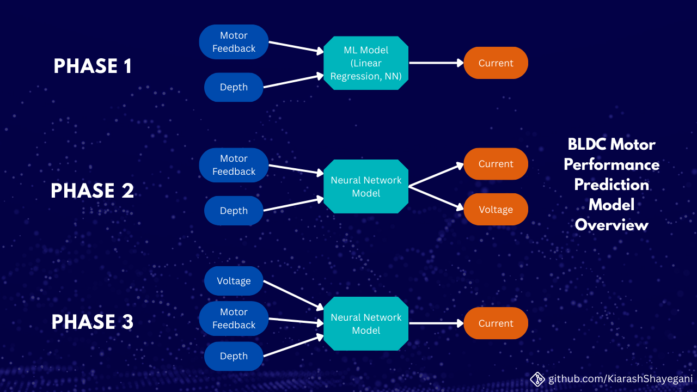

# 🚀 BLDC Motor Performance Prediction: An Applied ML Case Study

**Predicting motor current and voltage from real-world robotic sensor logs using progressive neural network modeling.**

## 📖 Project Overview
This project involved a **multi-phase collaboration** with a robotics engineering team to build predictive models for a Brushless DC (BLDC) motor's operational parameters. Using real, time-series sensor logs, the goal evolved from basic regression to advanced, multi-output neural networks with techniques to handle challenging data artifacts.

## 🎯 Business & Engineering Problem
Robotics teams need accurate digital models of motor behavior for simulation and control. Predicting current (`Power-Prop I`) and voltage (`Power-Prop V`) from inputs like motor speed (`Motor-FB`) and `Depth` allows for better system modeling, efficiency analysis, and virtual sensor creation.

## 🔬 Methodology & Progressive Solution
The project was executed in three technical phases, each increasing in complexity:

| Phase | Goal | Inputs -> Outputs | Key Techniques | Outcome (R² Score) |
| :--- | :--- | :--- | :--- | :--- |
| **1. Baseline & Validation** | Establish a performance baseline and prove NN superiority. | `[Motor-FB, Depth]` -> `[Power-Prop I]` | Linear Regression vs. Simple FFNN | NN: **0.91** vs. Linear: **0.59** |
| **2. Multi-Output Challenge** | Predict both current **and** voltage simultaneously. | `[Motor-FB, Depth]` -> `[Power-Prop I, Power-Prop V]` | MinMax Scaling, DNN | Current: **0.94**, Voltage: **0.65** (Identified voltage prediction as key challenge) |
| **3. Advanced Engineering** | Maximize accuracy, especially for low-variance voltage signals. | `[Motor-FB, Depth, Power-Prop V]` -> `[Power-Prop I]` | **Robust Scaling, Leaky-ReLU, L2 Regularization, Dropout, Moving Average Smoothing, Controlled Noise Addition, Early Stopping** | Final Model: **~0.94** (93.9% avg on secondary datasets) |

## 🛠️ Tech Stack & Tools
- **Programming:** Python
- **ML Frameworks:** TensorFlow/Keras, Scikit-learn
- **Libraries:** Pandas, NumPy, Matplotlib, Joblib
- **Data Processing:** RobustScaler, MinMaxScaler, Rolling-Window Smoothing
- **Techniques:** Hyperparameter Tuning, Regularization (L2), Dropout, Early Stopping

## 📈 Key Results & Insights
- **Successfully demonstrated** that neural networks (**91% R²**) vastly outperform traditional linear regression (**59% R²**) for this non-linear, real-world physics problem.
- **Diagnosed and mitigated** a key data challenge: the low-resolution, "steppy" nature of the logged voltage signal, which initially hampered model performance.
- **Engineered a solution** by applying a moving-average filter and controlled noise, which improved the model's generalization by **~3%** on unseen secondary datasets.
- **Delivered production-ready assets** including trained `.h5` models, fitted scalers (`.pkl`), and a clean data pipeline.
---
*This project was conducted in collaboration with the **Sina Robotics Innovation Team - برنانواندیشان سینا** as part of an applied ML research initiative. All the credits for dataset gathering goes to their brilliant team.*
